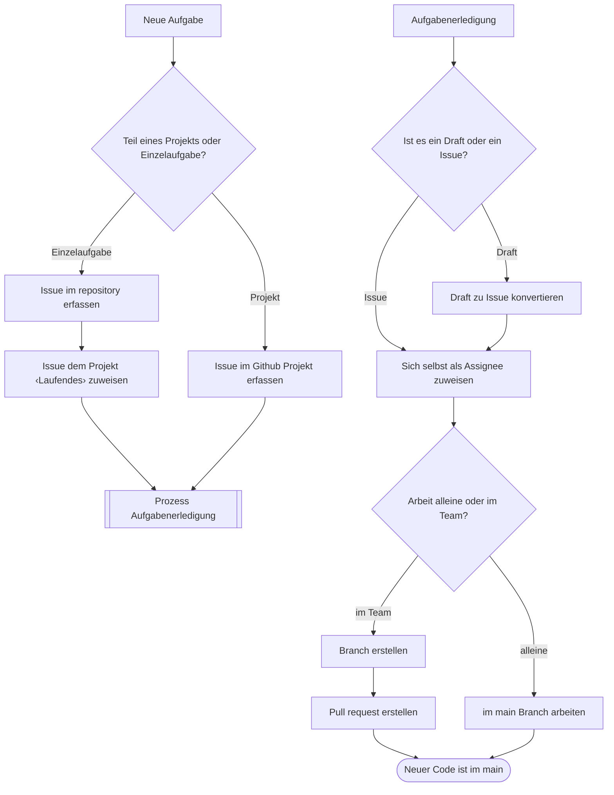

# Projektzyklus

## Projekt in Github

## Laufendes in ‹C Laufendes›

## Aufgabenfluss

```mermaid
flowchart TB
A@{ shape: process, label: "Neue Aufgabe" }
B@{ shape: decision, label: "Teil eines Projekts oder Einzelaufgabe?" }
C1@{ shape: process, label: "Issue im repository erfassen" }
C2@{ shape: process, label: "Issue im Github Projekt erfassen" }
E@{ shape: process, label: "Issue dem Projekt ‹Laufendes› zuweisen" }
F@{ shape: subproc, label: "Prozess Aufgabenerledigung" }

M@{ shape: process, label: "Aufgabenerledigung" }
N@{ shape: decision, label: "Ist es ein Draft oder ein Issue?" }
O1@{ shape: process, label: "Draft zu Issue konvertieren" }
P@{ shape: process, label: "Sich selbst als Assignee zuweisen" }
Q@{ shape: decision, label: "Arbeit alleine oder im Team?" }
R1@{ shape: process, label: "Branch erstellen" }
R2@{ shape: process, label: "im main Branch arbeiten" }
S1@{ shape: process, label: "Pull request erstellen" }
T@{ shape: stadium, label: "Neuer Code ist im main" }


A --> B
B-- Einzelaufgabe --> C1
B-- Projekt --> C2
C1 --> E
E --> F
C2 --> F

M --> N
N-- Draft --> O1
N-- Issue --> P
O1 --> P
P --> Q
Q-- im Team --> R1
Q-- alleine --> R2
R1 --> S1
S1 --> T
R2 --> T
```
